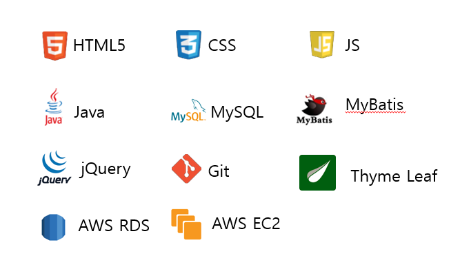

# **한강 교량 혼잡도 분석과 실시간 교통정보 공유 커뮤니티 - 한량**

## 프로젝트 개요

**한량**은 데이터 분석을 통해 미래의 다리 교통량을 예측하고 그에 따른 혼잡도를 보여주며, 교통 정보를 공유할 수 있는 커뮤니티 서비스를 제공합니다.

### 핵심기능

🔒**회원 가입을 통한 커뮤니티 이용** 

**📖분석을 통한 미래의 다리 교통량 예측**

### 인원

- 정상필 외 3명

### 진행 기간
- 진행 기간: 2022년 10월 24일 → 2022년 12월 2일

### 프로젝트 기여도 및 역할

- **정상필** :
    - 프로젝트 주제 및 서비스 주요 기능 관련 아이디어 기획
    - 교통량 예측 결과 출력 맵 개발
    - 커뮤니티 서비스 개발
    - AWS EC2와 AWS RDS를 이용한 배포
    
    > 게시글 CRUD와 카카오맵을 이용한 혼잡도 예측 결과 출력 기능 개발과 AWS를 통한 배포를 담당했습니다.

## 🐈‍⬛ GitHub

[GitHub](https://github.com/JungBear/public_transport_webproject)

## 🛠️ 개발 환경

## ↔️ ERD

## ppt

### 📌맡은 역할

<aside>
💡 **혼잡도 예측**

</aside>

<aside>
💡 커뮤니티

</aside>

### 어려웠던점

- 강의을 듣고 처음으로 진행하는 프로젝트여서 웹 개발하는 과정에 대해 정확하게 숙지를 하지 못했다 → 강의 시간 때 배웠던 내용들과 추가로 여러 글들을 보면서 하나의 페이지를 먼저 완성함으로써 웹 개발 과정에 대해 숙지하는 과정을 진행하였다

### 느낀점

- **협업의 중요성:** 회의를 매주 진행함으로써 팀원들과의 긴밀한 소통과 협업을 도모하였지만 그럼에도 부족함을 느껴 협업을 진행할 때에는 의사소통이 중요하다는 것을 깨달았습니다.